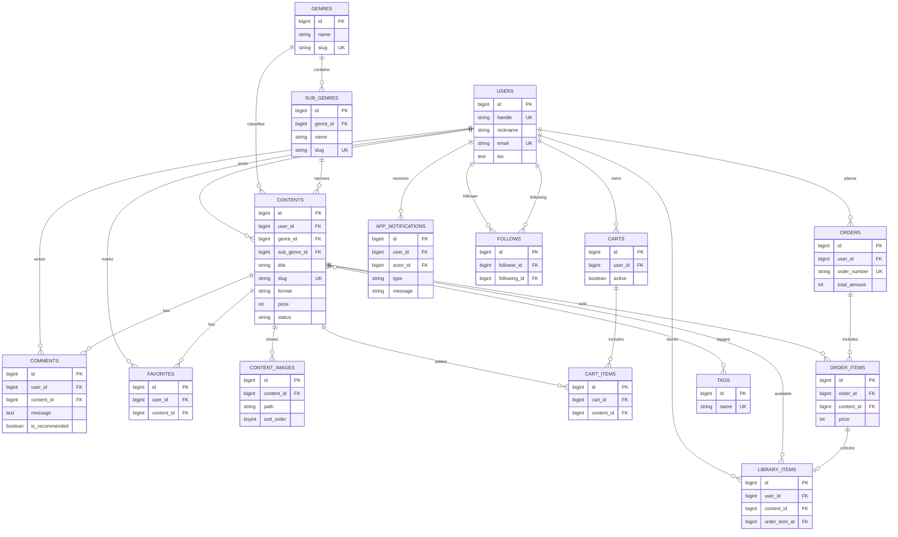

# DigitalAssetPort

DigitalAssetPort は、Excel / Word / Notion テンプレート、生活ノウハウ、学習教材、コード演習セット、動画素材、3Dモデルなどのデジタルデータを販売・配布できる Laravel 製ポートフォリオアプリです。

## ローカル起動

```bash
docker compose up -d
docker compose exec php composer install
docker compose exec php php artisan storage:link
docker compose exec php php artisan migrate --seed
```

- アプリ: `http://localhost`
- MailHog: `http://localhost:8025`
- サンプルログイン: `admin@example.com` / `password`
- Seeder は 12ユーザー、36コンテンツ、購入履歴、通知、フォロー、お気に入りを作成します。

## 主な機能

- Laravel Fortify による登録、ログイン、メール認証
- デジタルコンテンツの投稿、編集、検索、詳細表示
- お気に入り、コメント、フォロー、通知
- カート、Stripe Checkout、ローカル決済フォールバック
- 購入履歴、ライブラリ、ダウンロード
- 売上管理

## ER図


