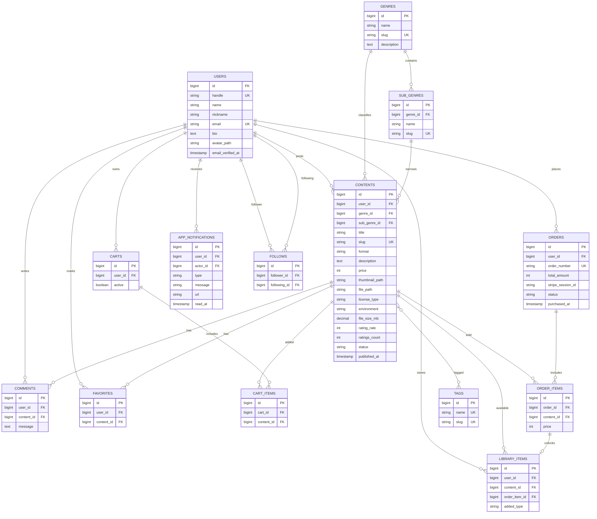

# DigitalAssetPort

DigitalAssetPort は、Excel / Word / Notion テンプレート、店舗運営マニュアル、学習教材、コード演習セット、動画素材、3Dモデルなどのデジタルデータを販売・配布できる Laravel 製ポートフォリオアプリです。

## 使用技術

- PHP 8.1 / Laravel 8
- Laravel Fortify
- MySQL 8
- Docker / Docker Compose
- MailHog
- Stripe Checkout
- HTML / CSS / JavaScript

## ローカル起動

```bash
cd /home/ubuntuiwa/e/c/DigitalAssetPort
docker compose up -d
docker compose exec php composer install
docker compose exec php php artisan storage:link
docker compose exec php php artisan migrate --seed
```

ブラウザで `http://localhost` を開きます。
MailHog は `http://localhost:8025` で確認できます。

## サンプルアカウント

全アカウントのパスワードは `password` です。

- `admin@example.com`
- `office@example.com`
- `code@example.com`
- `study@example.com`
- `creative@example.com`

## 実装済み画面

- ルートページ
- DigitalAssetPort紹介画面
- 詳細検索画面
- コンテンツ詳細画面
- ログイン画面
- アカウント登録画面
- 認証メール送付済みメッセージ画面
- ユーザー情報登録画面
- ユーザープロフィール画面
- アカウント設定画面
- お気に入り一覧画面
- コンテンツ投稿 / 編集画面
- 売上管理画面
- カート内商品一覧画面
- 購入履歴一覧画面
- 購入履歴詳細画面
- ライブラリ画面
- フォロー一覧画面
- フォロワー一覧画面
- 通知一覧画面

## Stripe

`.env` に `STRIPE_KEY` と `STRIPE_SECRET` を設定すると Stripe Checkout に遷移します。
未設定の場合は、ローカルポートフォリオ用に「ローカル決済完了」として購入履歴とライブラリを作成します。

## ER図


